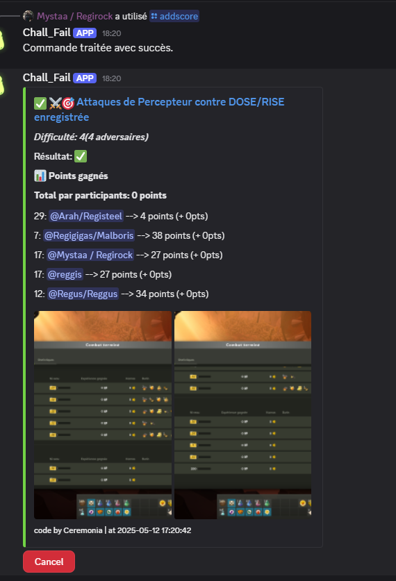
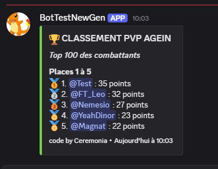
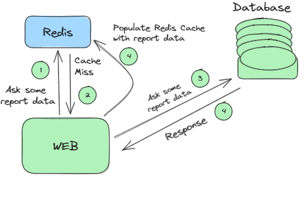

# ChallFail_discord_bot
This Python script is a Discord bot designed to keep track of the challenge scores for you and your friends during your Dofus adventures. The bot allows players to compete in a friendly challenge, user can send their own score and keep an overview of the ladder. Admin can manage the score of the players if needed.

In addition the bot also have a "/tryexo" command to simulate a forgemagie case (based on the 1% success rate) and a "/exoscore" command to show the players with the lowest success rate.

the command "/profile" allow to show the global profile of a player.

## Installation 
    je dois encore l'ecrire 

## Main usage
    -> Players who participate to an in game activities
    like percepteur attack or defense can
    send their score to the bot using the "/addscore" command.
    the bot receive data from the discord user, manage the score and update the ladder.
    
    -> In case of input error, the bot allow you 
    to cancel each interaction using the "cancel" 
    button or every user with an admin role can 
    use the "/adminpoint" command to add or remove points to a specific player.

    -> Players can get their full statistique using the "/profile" command.

 

## Exo Features
    -> "/tryexo" command allow to simulate a forgemagie case (based on the 1% success rate)
    and a "/exoscore" command to show the players with the lowest success rate.

## commande prefix : '!'
        !setmessage --> Redifine the static message that will display the ladder
        
        !clearLadder --> Delete all data from the ladder (reset points and rank of each player)

        !clearchannel --> Mainly utility command to clear a channel of messages (discord limits the number of messages deleted to 100 per call)

        !sync [guilds] [spec] --> Synchronize slash commands with Discord
            [guilds] --> (optional) IDs of servers to synchronize
            [spec] --> (optional) synchronization modifier:
                - without modifier: synchronizes globally
                - "~": synchronizes with the current server only
                - "*": copies global commands to the current server
                - "^": delete all commands from the current server

## commande slash 

        *argument optionnel 

        /addscore [event] [victory] [nb_of_opponent] [image] [image2] [joueur1] [joueur2*] [joueur3*] [joueur4*] [joueur5*] :

            [event] --> Make events configurable
            [victory : boolean] --> True or False (victory or defeat)
            [nb_of_opponent] --> 0, 1, 2, 3, 4, 5 (number of opponents)
            [image] --> image of the attack/defense
            [image2] --> image of the attack/defense
            [joueur1->5] --> discord pseudo of the players

        /adminpoint [action] [target] [nb_de_points] :
            [action] --> Add or remove points to a player
            [target] --> discord pseudo of the player
            [nb_de_points] --> number of points to add or remove

        /showscore : Show the ladder
        /exoscore : Show the exoscore
        /tryexo : Launch a small simulation of a forgemagie with a 1% success rate
        /profile [target*] : Show the profile of a player or your own if no target is specified
        
## Project structure
.
├── DiscordID.json
├── LadderArchives
│   └── LadderArchives2025-05-17_16-56-04.json
├── commandsArchives
│   └── Admincommand.txt
├── db
│   ├── player_db.json
│   └── player_db.txt
├── dockerfile
├── images
├── requirements.txt
├── src
│    ├── button
│    ├── commandes
│    ├── myembed
│    └── utils
            
